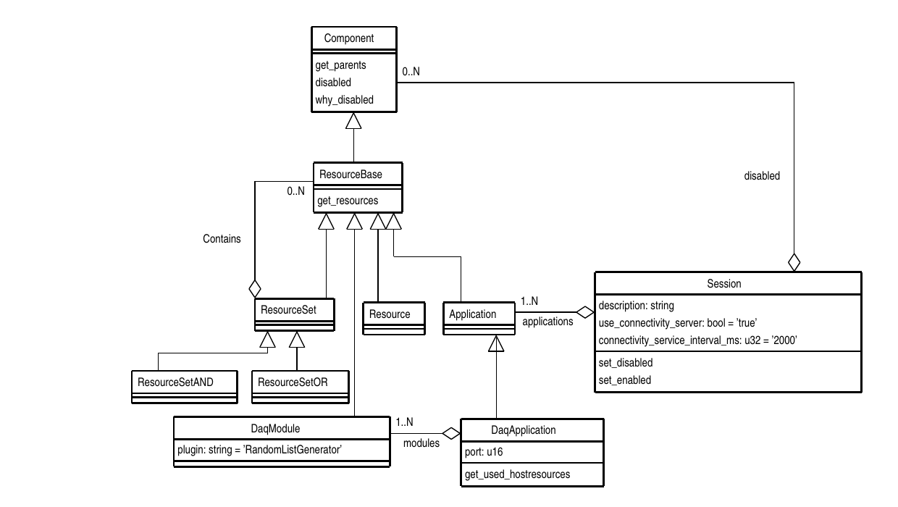

# dunedaqdal
This package contains a putative 'core' schema for dunedaq OKS configuartion.

  

This version now has the Resource suite of classes borrowed from the
ATLAS core schema. As a first example of using these, the Application
and DaqModule classes now inherit from ResourceBase so all
applications and individual DAQModules can be disabled by adding them
to the `disabled` relationship of the Session.

  

There is a new simple application `list_apps` to list the applications
and their modules, indicating their disabled state where set.

## Notes

### VirtualHost

 The idea is that this decribes the subset of resources of a physical
host server that are available to an Application. For example two
applications may be assigned to the same physical server but each be
allocated resources of a different NUMA node.

### DaqApplication and DaqModule

 The DaqApplication contains a list of DaqModules each of which has a
list of used resources. The DaqApplication provides a method
`get_used_hostresources` which can be called by `appfwk` in order to check
that these resources are indeed associated with the VirtualHost by
comparing with those listed in its `hw_resources` relationship.

### NetworkConnection

  Contains a `uri` attribute for compatability with existing `moo`
  schema. Hope that `protocol` and `port` can be used to construct a
  uri with an address derived from the `Host`'s `NetworkInterface`s.
