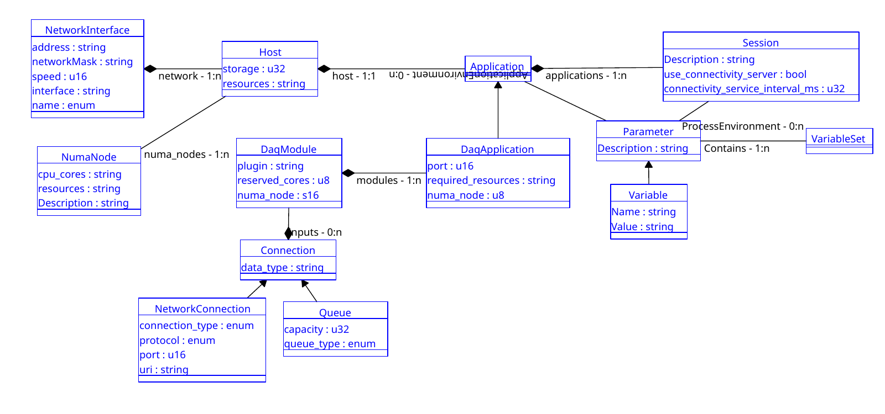

# dunedaqdal
This package contains a putative 'core' schema for dunedaq OKS configuartion.

  

## Notes

### Host and NumaNode

 The idea is that these decribe the physical host server and that any
restrictions to the list of CPU cores to be used by an application are
specified in the Application configuartion.

### DaqApplication and DaqModule

 The DaqApplication can be restricted to using only a subset of the
NUMA nodes on its host by the `numa_node` list. The DaqModule can ask
for cores for its threads to be allocated from one of the NUMA nodes
associated with the DaqApplication.

* Is this too complicated?
* Is it error prone in that the node specified by the DaqModule may
not be listed in the DaqApplication?

### NetworkConnection

  Contains a `uri` attribute for compatability with existing `moo`
  schema. Hope that `protocol` and `port` can be used to construct a
  uri with an address derived from the `Host`'s `NetworkInterface`s.
